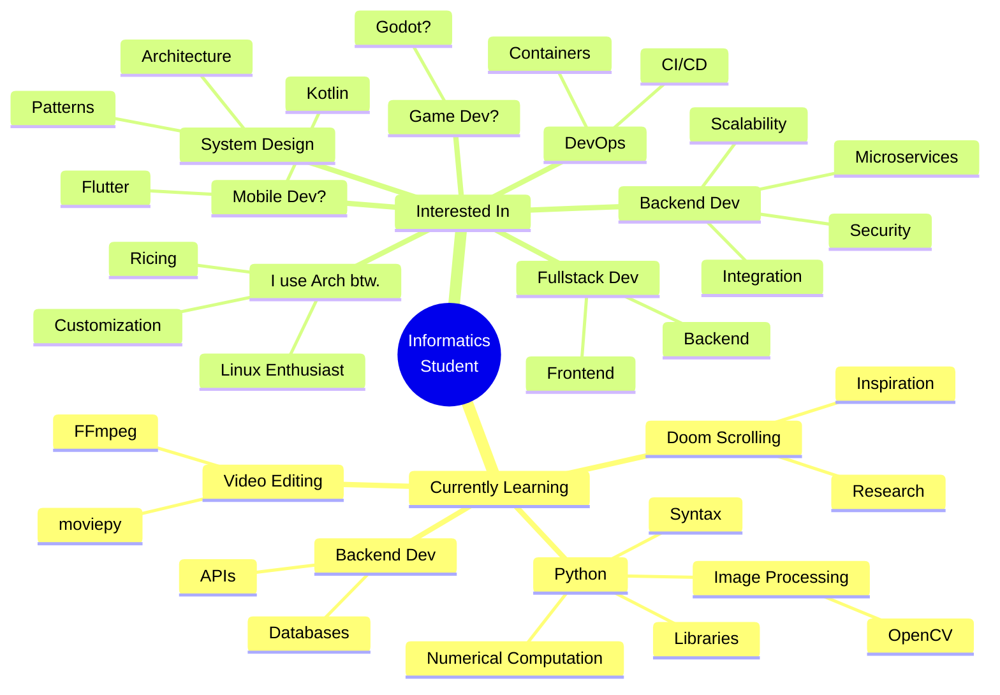
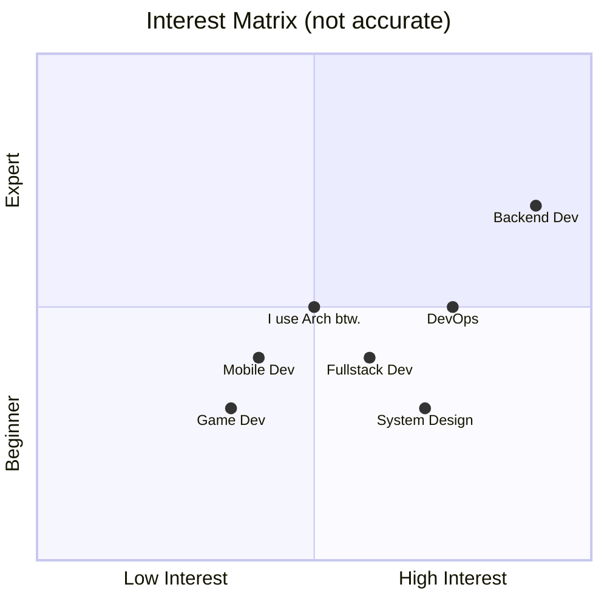

# $\texttt{Hello, My Name is} \ \displaystyle \sum_{i=1}^{1} \prod_{j=1}^{6}\vec{X_j} \prod_{k=1}^{8}\vec{Y_k}$

$$
\vec{X} = (i, k, h, s, a, n), \quad \vec{Y} = (s, a, t, r, i, a, d, i)
$$

$$
\therefore \ \texttt{Hello, My Name is} \ ikhsan \cdot satriadi
$$

> [!NOTE]
>
> This formula did not pass the lecturer's validation test, but it ~~failed~~ **passed the aesthetics test**.

---

#### What I'm currently learning & working on



If u don't like mindmap

```c
void main()
{
  char *info = "I'm currently an informatics engineering student.";

  char *currently_learning[] = {
      "Python",
      "Image Processing",
      "Backend Dev",
      "Video Editing (with code)",
      "Doom Scrolling (when necessary)"
  };

  char *interested_in[] = {
      "Backend Dev",
      "System Design",
      "DevOps",
      "Fullstack Dev",
      "Mobile Dev?",
      "Game Dev?"
  };

  static const char *important = "I use Arch btw.";
}
```



#### Here some ascii art

```diff
-              ██▓ ██ ▄█▀ ██░ ██   ██████  ▄▄▄       ███▄    █ █████▓ ▄▄▄      ▓█████▄  ██▓              
-             ▓██▒ ██▄█▒ ▓██░ ██▒▒██    ▒ ▒████▄     ██ ▀█   █ ▀   █▓▒████▄    ▒██▀ ██▌▓██▒              
-             ▒██▒▓███▄░ ▒██▀▀██░░ ▓██▄   ▒██  ▀█▄  ▓██  ▀█ ██▒  ███▒▒██  ▀█▄  ░██   █▌▒██▒              
-             ░██░▓██ █▄ ░▓█ ░██   ▒   ██▒░██▄▄▄▄██ ▓██▒  ▐▌██▒▄  █▓▒░██▄▄▄▄██ ░▓█▄   ▌░██░              
-             ░██░▒██▒ █▄░▓█▒░██▓▒██████▒▒ ▓█   ▓██▒▒██░   ▓██░████▒░▒▓█   ▓██▒░▒████▓ ░██░              
-             ░▓  ▒ ▒▒ ▓▒ ▒ ░░▒░▒▒ ▒▓▒ ▒ ░ ▒▒   ▓▒█░░ ▒░   ▒ ▒  ░▒ ░░░▒▒   ▓▒█░ ▒▒▓  ▒ ░▓                
-              ▒ ░░ ░▒ ▒░ ▒ ░▒░ ░░ ░▒  ░ ░  ▒   ▒▒ ░░ ░░   ░ ▒░  ░ ░ ░ ▒   ▒▒ ░ ░ ▒  ▒  ▒ ░              
-              ▒ ░░ ░░ ░  ░  ░░ ░░  ░  ░    ░   ▒      ░   ░ ░   ░     ░   ▒    ░ ░  ░  ▒ ░              
-              ░  ░  ░    ░  ░  ░      ░        ░  ░         ░   ░   ░     ░  ░   ░     ░                
-                                                                               ░                        
```
