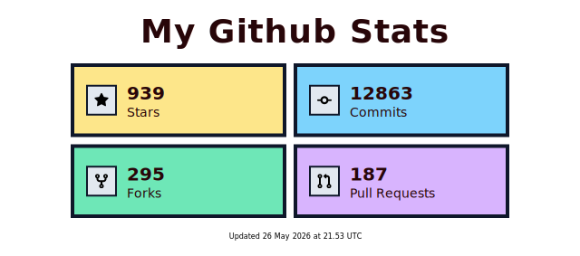

<h1 align="center">
$\huge{\mathbb{IKHSAN \ SATRIADI}}$
</h1>

```cpp
#include <bits/stdc++.h>
using namespace std;

int main()
{
    string info = "I'm currently an informatics engineering (or computer science) student.";

    vector<string> currently_learning = {
        "Software Engineering",
        "Android / Flutter Dev",
        "Image Processing",
        "Backend Dev",
    };

    map<string, set<string>> something_about_me = {
        {"Hobbies", {"Walking", "Cycling", "Write something like this"}},
        {"Favorite Animal", {"Cat"}},
        {"Operating System", {"Arch Linux"}},
        {"Favorite App", {"Web Browser", "Terminal"}},
        {"Hates", {"Windows 11", "Slow & Bloated Apps", "AI Slop", "Pra.. 🔫"}}, // dor!
        {"Girlfriend", {}},
    };

    return 0;
}
```

<!-- awas disiram air keras -->

<p align="center">
  <a href="https://ikhsan3adi.github.io/#portfolio" target="_blank" title="My GitHub Stats, click to see them more">
    <picture>
      <source
        media="(prefers-color-scheme: dark)"
        srcset="./profiles/simple-stats-dark.svg"
      />
      
    </picture>
  </a>
</p>
