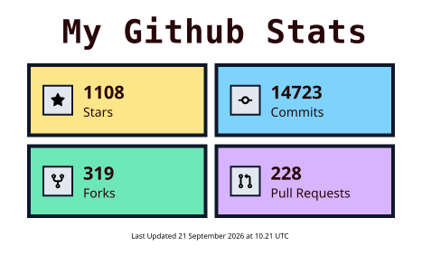
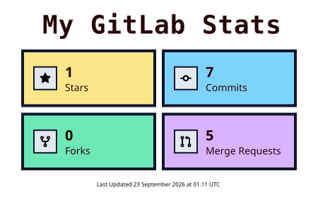
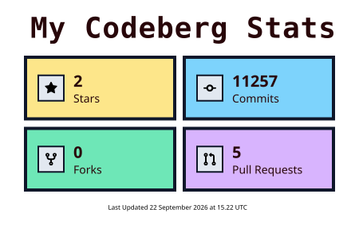

  
<code>696b6873616e33616469</code>

  <h1 align="center" title="ikhsan3adi" id="ikhsan3adi">
    <picture>
      <source
        media="(prefers-color-scheme: dark)"
        srcset="./profiles/wordmark-dark.svg"
      />
      
    </picture>
  </h1>
  
  <!-- keren bgt jir -->
  
  

    <a href="https://ikhsan3adi.github.io" target="_blank" title="Visit my portfolio website">
      <picture>
        <source
          media="(prefers-color-scheme: dark)"
          srcset="./profiles/github-stats-dark.svg"
        />
        
      </picture>
    </a>
  

  

    <a href="https://gitlab.com/ikhsan3adi" target="_blank" title="My GitLab">
      <picture>
        <source
          media="(prefers-color-scheme: dark)"
          srcset="./profiles/gitlab-stats-dark.svg"
        />
        
      </picture>
    </a>
    <a href="https://codeberg.org/ikhsan3adi" target="_blank" title="My Codeberg">
      <picture>
        <source
          media="(prefers-color-scheme: dark)"
          srcset="./profiles/codeberg-stats-dark.svg"
        />
        
      </picture>
    </a>
  

> **None of these stats are accurate!!!** (especially commit count)

<!-- awas disiram air keras -->
